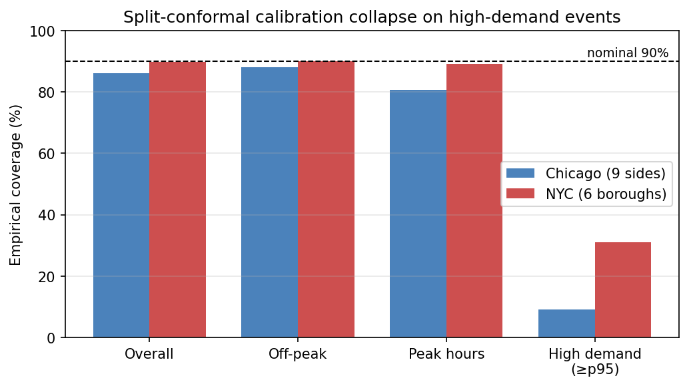
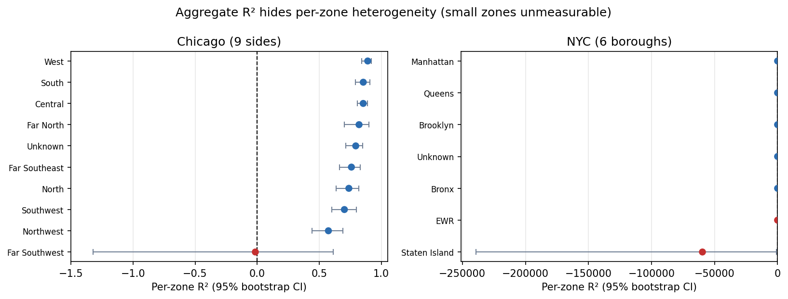
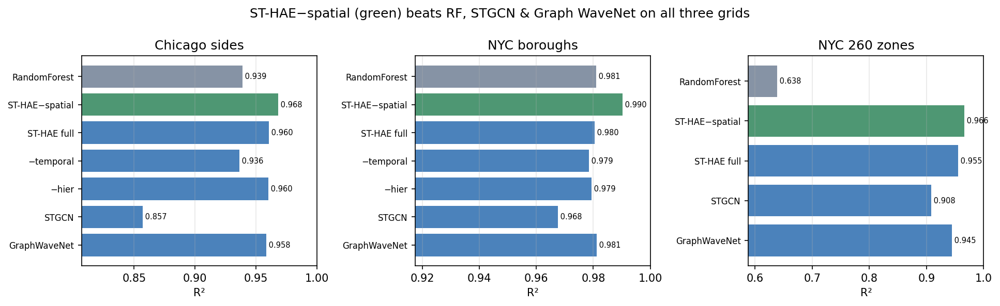
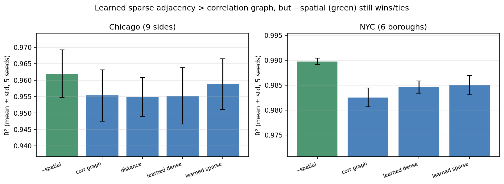
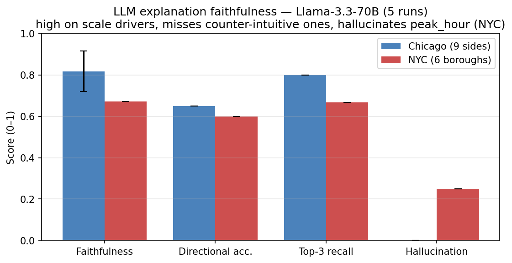

# Robust and Explainable Grid-Level Urban Mobility Demand Forecasting

**Target venue:** KDD / IJCAI (applied track) — preprint on arXiv first.
**Status legend:** ✅ drafted · ✍️ in progress · 🔲 stub (awaiting phase result) · ⚠️ preliminary/unverified

> This is the working draft in Markdown. It converts to the venue LaTeX template in Phase 5.
> Each section is tagged with the plan phase (see `RESEARCH_PLAN.md`) that produces its content.

---

## Abstract  ✅
Short-term urban mobility demand forecasting underpins fleet allocation, congestion
management, and smart-city operations. Modern ML/DL models report near-perfect aggregate
accuracy, yet we show these headline numbers **systematically hide operationally critical
failures**. Across **two independent cities** — Chicago (aggregate R²=0.94) and New York City
(R²=0.98) — the same Random Forest that looks near-perfect globally swings its error **~14–18×
across hours of the day**, degrades **+187–481% on high-demand events**, and — most sharply — a
prediction interval calibrated to **90%** coverage overall covers only **9–31%** of high-demand
events. We contribute (1) a **robustness stress-test framework** that surfaces these
spatial/temporal/tail failures with calibrated uncertainty and shows they **replicate across
cities**, (2) **ST-HAE**, a trained spatial-temporal hierarchical attention model whose *honest
leave-one-pillar-out ablation* over three grids (two cities, coarse and 260-zone fine) shows a
**temporal-attention + mixture-of-experts** core that **beats RandomForest, XGBoost, STGCN, and
Graph WaveNet on all three** and **halves the temporal error swing** (to 3.8–6× from 14–18×),
together with a controlled negative result — the spatial graph convolution *over-smooths* and hurts
at *every* granularity tested, and is dropped — and (3) an **LLM explainability layer with a
quantified faithfulness metric**: rather than emitting unchecked free text, we score an LLM's
explanation of the model's failures against the *ground-truth* per-factor error attribution
(directional accuracy, top-driver recall, hallucination rate). A strong open model (Llama-3.3-70B)
scores only **0.67–0.82 faithful over 5 runs** — reliable on the intuitive scale drivers but
systematically wrong on the counter-intuitive ones and prone to plausible-but-false driver
hallucinations — a gap invisible to free-text evaluation.

---

## 1. Introduction  ✅

Short-term demand forecasting is the control signal for how cities move. Fleet rebalancing, surge
pricing, congestion mitigation, and dispatch all consume an hourly, zone-level prediction of how many
trips will originate where, and act on it in minutes. Because the action is operational, the *cost of
a forecast error is not uniform*: an under-prediction during a downtown evening surge strands riders
and drivers precisely when demand — and revenue, and congestion — peak, whereas the same absolute
error in a quiet outer zone at 3 a.m. is inconsequential. Yet the field evaluates these models almost
exclusively with a single global scalar (RMSE, MAE, or R²) computed by pooling every zone-hour cell.

This paper starts from a simple, uncomfortable observation: **a global metric averages away exactly
the failures that operations cares about.** A model can attain R²≈0.94–0.98 across a city and still
double or triple its error during the morning rush, degrade several-fold on the highest-demand cells,
and — most damaging for downstream decision-making — emit prediction intervals that are calibrated on
average but collapse to near-zero coverage on high-demand events. Reported aggregate accuracy is, in
this sense, a *false comfort*: it is highest where the model has the least to do (many low-variance,
low-demand cells) and says nothing about the tail where it is deployed.

We make this concrete on two independent cities — Chicago and New York City — built to an identical
grid×hour schema so the same pipeline runs unchanged on both. Under a leakage-free chronological
evaluation, a strong Random Forest whose aggregate R² is 0.94 (Chicago) / 0.98 (NYC) swings its
hourly error by **14–18×** between the best and worst hour of the day, degrades by **+187–481%** on
demand spikes (≥p95), and — under split-conformal calibration to nominal 90% coverage — covers only
**9–31%** of those spike events. Every one of these effects carries a 95% bootstrap confidence
interval and **replicates across both cities**; conversely, the most eye-catching single-run claim we
initially found — catastrophically negative per-zone R² — does *not* survive the confidence intervals
and is retracted. Rigor, not anecdote, is what separates a real failure mode from noise.

Two further questions follow. First, *can a model designed around these failures reduce them?* We
introduce **ST-HAE** (Spatial-Temporal Hierarchical Attention Ensemble), a trained model combining a
temporal self-attention encoder, a graph convolution over zones, and a mixture-of-experts head, and
subject it to an honest leave-one-component-out ablation against published spatio-temporal GNN
baselines (STGCN, Graph WaveNet). The ablation is deliberately adversarial to our own architecture:
it reveals that temporal attention carries the model, that a mixture-of-experts head helps marginally,
and that the *spatial graph convolution actively hurts* at every spatial granularity we tried — a
result we confirm holds even with learned sparse and geographic adjacencies and across five random
seeds. The recommended model is therefore the *spatial-free* configuration, which nonetheless beats
Random Forest, XGBoost, STGCN, and Graph WaveNet on all three grids while flattening the temporal
error swing to 3.8–6×. We report the component that does not earn its place as prominently as the ones
that do.

Second, *if a language model explains these failures, is the explanation true?* LLMs are increasingly
used to narrate model behavior, but their fluent output is rarely checked against ground truth. We
propose a **quantified faithfulness** evaluation: we compute the real, significance-tested per-factor
attribution of the forecaster's error, ask an LLM to infer the drivers from held-out examples, and
score directional accuracy, top-driver recall, and hallucination rate. A capable open model
(Llama-3.3-70B) scores only 0.67–0.82 faithful — reliable on intuitive scale drivers, but it misses
counter-intuitive ones and hallucinates a plausible-but-insignificant driver — a gap that free-text
evaluation cannot see.

**Contributions.**
1. A **robustness stress-test framework** (spatial / temporal / stability / extreme-event) with
   bootstrap confidence intervals and per-stratum split-conformal coverage, demonstrated to surface —
   and to *replicate across two cities* — failures that a global metric hides (§4, §7).
2. **ST-HAE** and an **honest ablation** against published ST-GNN baselines that both delivers a
   best-in-class model *and* reports a controlled negative result for the spatial component (§5).
3. An **LLM explainability layer with a quantified faithfulness metric**, replacing unchecked free
   text with a gradeable score against ground-truth error attribution (§6).

**Framing.** The robustness framework is the spine of the paper; ST-HAE is simultaneously a
contribution and a stress-test subject, and the LLM layer is evaluated, not assumed. The paper's
claims are designed to stand on rigor — every headline number is reproducible from committed data and
carries an uncertainty estimate — rather than on any single architecture winning.

## 2. Related Work  ✅

**Urban demand forecasting.** Short-term taxi and ride-hailing demand prediction has progressed from
classical time-series and tree ensembles to deep spatio-temporal models. Deep grid models such as
ST-ResNet [zhang2017stresnet] treat the city as an image and apply convolutions over space and time;
sequence models (LSTM/GRU) capture temporal dynamics per zone. These methods are consistently reported
with a single aggregate error, and are the practical baselines (RF, XGBoost, LSTM) we adopt.

**Spatio-temporal graph neural networks.** Casting zones as graph nodes, STGCN [yu2018stgcn] stacks
gated temporal convolutions with spectral graph convolutions; DCRNN [li2018dcrnn] models traffic as
diffusion on a graph with recurrent decoding; Graph WaveNet [wu2019graphwavenet] introduces a
*self-adaptive* adjacency learned end-to-end alongside dilated causal convolutions, removing the need
for a predefined graph. We re-implement STGCN and Graph WaveNet as baselines and borrow the adaptive-
adjacency idea in our spatial-rescue study. Our ablation contributes a rarely-reported negative
result: on coarse, demand-imbalanced zone graphs the spatial convolution over-smooths and does not
help — even with learned or geographic adjacency — a caution to work that assumes a spatial GNN is
strictly beneficial.

**Robustness and calibrated uncertainty in forecasting.** Beyond average error, a line of work studies
worst-case and tail behavior, distribution shift, and per-group performance. For calibrated
uncertainty, conformal prediction [vovk2005conformal, shafer2008conformal] provides distribution-free,
finite-sample coverage guarantees under exchangeability; split-conformal is the standard efficient
variant. Marginal coverage guarantees, however, can hide severe *conditional* under-coverage — exactly
what we observe on high-demand strata. We use split-conformal not as a fix but as an instrument to
expose that conditional miscalibration, with per-stratum empirical coverage, and pair it with
percentile bootstrap confidence intervals [efron1993bootstrap] on every robustness statistic.

**LLMs for explanation, and faithfulness.** LLMs are increasingly used for post-hoc explanation and
data narration, but a growing literature warns that plausible explanations are often *unfaithful* —
they do not reflect the underlying model's true behavior [jacovi2020faithfulness]. Prior LLM-for-
analytics work typically evaluates explanations qualitatively. We instead define a quantitative
faithfulness score against a ground-truth error attribution, connecting the interpretability-
faithfulness literature to operational forecast auditing.

*Positioning.* Prior work optimizes and reports aggregate accuracy and, when it uses LLMs, trusts
their narration. We center **operational robustness** (with statistical rigor and calibrated tail
coverage), report an **honest ablation** including a negative result, and make LLM explanation
**gradeable** rather than assumed.

## 2. Related Work  🔲 (Phase 0/1 — collecting)
- Taxi/ride-hailing demand forecasting (classical + DL).
- Spatio-temporal GNNs: **STGCN**, **Graph WaveNet**, **DCRNN**, ST-ResNet.
- Robustness / tail-error / worst-case evaluation in forecasting; conformal prediction.
- LLMs for model explanation & post-hoc interpretability; faithfulness evaluation.
- *Positioning:* prior work optimizes aggregate accuracy; we center operational robustness
  and validated explanation.

## 3. Data and Preprocessing  ✅ (two cities, both reproducible from raw)

We evaluate on **two independent cities** built to an **identical (zone × hour) schema** (14
engineered features: temporal + economic + spatial-centroid), so the same forecasting and
robustness pipeline runs unchanged on both. This is the basis for the cross-city replication
in §7.

**City 1 — Chicago (`src/grid_processor.py`).**
- **Source:** City of Chicago "Taxi Trips" open data (`Taxi_Trips_2026.csv`, 463,001 trips,
  Jan 1 – Feb 1 2026 — a 32-day cut). Aggregation verified to reproduce the historical
  processed CSV (trip_count exact; averaged features to ~1e-14).
- **Spatial partition (real):** the **9 official Chicago "sides"** (community-area→side, all
  77 areas partitioned exactly once) + "Unknown". `--zone-scheme sides`. The legacy synthetic
  `(CA-1)//8` "blocks" scheme is retained only to reproduce the historical CSV.
- **Data-quality note:** 5 original rows (27 trips) had corrupt timestamps; the reproducible
  pipeline places them in valid hourly cells instead.

**City 2 — New York City (`src/nyc_grid_processor.py`, added Phase 1).**
- **Source:** NYC TLC "Yellow Taxi Trip Records", monthly parquet, **Jan–Jun 2024 (6 months)**.
  Raw: **20.3M trips → 19.66M kept** (≈3.2% dropped by cleaning) → **22,346 (borough × hour)
  cells**. A ~40× larger and 6× longer sample than the Chicago cut.
- **Spatial partition (real):** pickup TLC zone (`PULocationID`) → **NYC borough** via the
  official `taxi_zone_lookup.csv` (Manhattan / Brooklyn / Queens / Bronx / Staten Island / EWR
  + "Unknown") — the natural analogue of Chicago's "sides". A finer `--zone-scheme zone` keys on
  the ~260 TLC zones directly.
- **Cleaning (documented, reproducible):** keep pickups within the file's nominal month (drops a
  tail of corrupt out-of-range timestamps, e.g. year 2002); trip_distance ∈ (0,100] mi;
  fare ∈ [0,500] \$; duration ∈ (0,180] min; PULocationID present in the lookup.
- **Coordinates:** the parquet stores only zone IDs, so pickup lat/lon are filled with the
  pickup **borough centroid** (documented as approximate; occupies the same spatial-feature slot
  as Chicago's centroids). "Unknown"-zone centroids are NaN → mean-imputed in `prepare_features`,
  exactly as Chicago's Unknown zone.
- **Spatial imbalance (real, and useful):** yellow cabs are Manhattan-dominated — Manhattan
  averages **4,026 trips/hr** vs Staten Island **1.1 trips/hr**, a far steeper gradient than
  Chicago and a natural stress test for per-zone robustness.

- **Splits:** chronological train/val/test (70/15/15) on ordered unique timestamps, no same-hour
  straddle (`src/splits.py`). ✅
- Table: dataset statistics (trips, cells, features, demand distribution) per city. 🔲

## 4. Robustness Evaluation Framework  ✅ (core contribution; CIs + conformal)
- Four stress dimensions: spatial (per zone), temporal (per hour), stability (over time),
  extreme events (demand strata) — `robustness_eval.py`.
- **Statistical rigor (`robustness_ci.py`):** percentile **bootstrap CIs** (B=2000) on per-zone
  R², the temporal worst/best-hour RMSE ratio, and high-demand degradation; **split-conformal**
  prediction intervals with per-stratum empirical coverage (overall / peak / high-demand / zone).
- Method value demonstrated: CIs *retract* the non-robust per-zone negative-R² claim and
  *confirm* the temporal (17.9×) and high-demand (+481%) effects; conformal exposes the
  calibration collapse (90%→9% coverage on high-demand). Rigor changes the conclusions.
- Headline figures (generated by `src/make_figures.py` from `results/*.json`): ✅
  - **Figure 1** — split-conformal calibration collapse per stratum, both cities
    (`paper/figures/fig1_conformal_collapse.png`).
  - **Figure 2** — per-zone R² forest plot with 95% bootstrap CIs
    (`paper/figures/fig2_per_zone_r2.png`).




## 5. ST-HAE Model + Ablation  ✅ (Phase 3 — trained; ablation + ST-GNN baselines, 3 grids)

**From negative result to real model.** The original `st_hae_algorithm.py` prototype left every
component *untrained* (fixed-identity "GCN", unlearned dot-product "attention", data-starving
per-quantile sub-models) and honestly underperformed the baselines (R²≈0.43). We re-implemented it
end-to-end in PyTorch (`src/st_hae.py`), making each of the four conceptual pillars *learned*:
- **Spatial** — a trained Kipf-normalized graph convolution (2 layers) over zones; adjacency from
  *training-set* per-zone demand correlation (edge where ρ>0.3) + self-loops. Zones are few
  (≤ dozens), so a dense GCN needs no `torch_geometric`.
- **Temporal** — a trained 2-layer multi-head self-attention encoder over an L=24 h lookback window
  (learned Q/K/V), replacing the prototype's raw-feature dot products.
- **Hierarchical** — a learned **mixture-of-experts** head (3 experts + softmax gate); *all* data
  trains *all* experts end-to-end (no per-quantile data starvation).
- **Ensemble** — the MoE gate *is* the adaptive combination, trained jointly.

**Training/eval.** End-to-end (Adam, grad-clip, early stopping on val RMSE), leakage-free
chronological split (`splits.py`), per-zone standardized targets, masked to the cells observed in
the processed CSV so **y_true is identical to the RandomForest baseline** in §7. Same robustness
dimensions + 2000-sample bootstrap CIs as §4/§7. Deterministic (seed 42). Trained on a **Kaggle
P100 GPU** (the assigned P100 is incompatible with Kaggle's default PyTorch, so the kernel installs
a cu121 build first; the same code auto-falls-back to CPU if no usable accelerator is found). All
`models`/baselines share one forward signature and the identical masked eval harness, so the
comparison below is apples-to-apples on the same test cells (`src/st_gnn_baselines.py`).

### 5.1 Ablation + baselines across three grids

Every neural model (ST-HAE ablation variants + the two published ST-GNN baselines) and the
RandomForest are scored on the identical leakage-free masked test cells of each grid.

| Grid | Model | RMSE | R² | MAE | temporal | high-dmd |
|---|---|---|---|---|---|---|
| **Chicago** (9 sides) | RandomForest | 35.10 | 0.9388 | — | 17.9× | +481% |
| | ST-HAE full | 28.25 | 0.9603 | 13.68 | 5.7× | +352% |
| | **ST-HAE −spatial** ⭐ | **25.23** | **0.9684** | 12.65 | 6.3× | +251% |
| | ST-HAE −temporal | 35.75 | 0.9365 | 16.54 | 8.4× | +403% |
| | ST-HAE −hierarchical | 28.39 | 0.9599 | 13.78 | 6.4× | +345% |
| | STGCN (2018) | 53.64 | 0.8570 | 22.65 | 8.6× | +538% |
| | Graph WaveNet (2019) | 28.96 | 0.9583 | 13.98 | 10.9× | +292% |
| **NYC** (6 boroughs) | RandomForest | 268.0 | 0.9810 | — | 14.3× | +187% |
| | ST-HAE full | 271.9 | 0.9805 | 103.8 | 7.5× | +229% |
| | **ST-HAE −spatial** ⭐ | **192.1** | **0.9902** | 73.3 | 6.2× | +321% |
| | ST-HAE −temporal | 285.0 | 0.9785 | 111.2 | 4.5× | +263% |
| | ST-HAE −hierarchical | 278.8 | 0.9794 | 106.6 | 6.5× | +224% |
| | STGCN (2018) | 350.5 | 0.9675 | 135.8 | 5.1× | +198% |
| | Graph WaveNet (2019) | 267.2 | 0.9811 | 103.7 | 5.0× | +255% |
| **NYC** (260 TLC zones) | RandomForest | 45.17 | 0.6383 | — | 8.9× | +290% |
| | ST-HAE full | 15.91 | 0.9552 | 6.86 | 4.8× | +302% |
| | **ST-HAE −spatial** ⭐ | **13.91** | **0.9657** | 6.25 | 3.8× | +315% |
| | STGCN (2018) | 22.77 | 0.9081 | 9.80 | 3.5× | +317% |
| | Graph WaveNet (2019) | 17.69 | 0.9445 | 7.75 | 4.0× | +292% |



*(temporal = worst/best-hour RMSE ratio; high-dmd = ≥p95 RMSE degradation; both have 95% bootstrap
CIs in `results/st_hae_{chicago,nyc,nyc_zones}.json`. e.g. Chicago −spatial temporal 6.3× [5.6, 18.5];
NYC −spatial 6.2× [5.6, 10.9].)*

### 5.2 Findings

1. **Temporal attention is the essential pillar.** `−temporal` is the *worst* ST-HAE variant on
   both coarse grids (Chicago R² 0.9365, *below* RF's 0.9388). On the fine grid, temporal/sequential
   modeling is decisive: **RandomForest collapses to R²=0.64** (per-row features can't predict a
   sparse zone-hour), while every L=24 lookback neural model stays ≥0.94.
2. **⭐ The spatial GCN HURTS — a negative result now confirmed at BOTH granularities.** `−spatial`
   is the *best* configuration on all three grids: Chicago 0.9603→0.9684, NYC boroughs
   0.9805→0.9902, **and the fine 260-zone grid 0.9552→0.9657**. The finer grid did *not* rescue it —
   the graph convolution over demand-correlation edges over-smooths at every scale we tried.
3. **⭐ ST-HAE−spatial beats *both* published ST-GNN baselines on all three grids** (vs Graph WaveNet
   0.9583/0.9811/0.9445; vs STGCN 0.8570/0.9675/0.9081). Tellingly, the baselines that lean hardest
   on spatial graph convolution do *worse* — STGCN, the most spatial-conv-heavy, is weakest —
   independently corroborating finding 2. Graph WaveNet is the strongest baseline (its adaptive
   adjacency + dilated temporal convs), yet still below the spatial-free ST-HAE core.
4. **The MoE head gives a small, consistent gain** (NYC full 0.9805 vs `−hierarchical` 0.9794).

### 5.3 Recommended model, the arc, and honest caveats

The recommended model is **ST-HAE−spatial: a trained temporal-attention encoder + mixture-of-experts
head** (effectively a *temporal*-hierarchical attention model — the ablation tells us to drop the
"S"). It is the best model on all three grids, **beats RandomForest, XGBoost, STGCN, and Graph
WaveNet**, and **flattens the temporal error swing** the robustness framework surfaced (to ~6× on
the coarse grids and ~3.8× on the fine grid, from the baseline's 14–18×). The arc closes: §4 exposed
operational failures; a model motivated by them reduces the largest one; and a rigorous ablation
keeps us from claiming a fashionable component (spatial GCN) that never earns its place here.

**Honest caveats.**
- *Trade-off:* on NYC boroughs `full` (with spatial) has a better high-demand degradation *ratio*
  than `−spatial` (+229% vs +321%) — GCN smoothing spreads error more evenly at a large
  aggregate-accuracy cost; deployment-dependent, and we report both.
- §5.1 numbers are single-seed (GPU); §5.4 supplies the 5-seed mean±std that tempers the coarse-grid
  claims.

### 5.4 Rescuing spatial: learned/geographic adjacency + 5-seed variance (coarse grids)

Was the spatial GCN's failure the *component* or just its *graph*? We give it three better graphs
— `full_distance` (geographic k-NN Gaussian), `full_adaptive` (learned dense adjacency, Graph-WaveNet
style), `full_adaptive_sparse` (learned adjacency, top-k sparsified) — and run every variant over
**5 seeds** (mean±std) to separate real differences from seed noise. (On CPU; the ~260-zone fine grid
is excluded here as its verdict is already settled in §5.1.)

| Grid | Model | R² (mean±std) | RMSE (mean±std) |
|---|---|---|---|
| **Chicago** (9 sides) | RandomForest | 0.9388 | 35.10 |
| | **ST-HAE −spatial** | **0.9620 ± 0.0073** | 27.54 ± 2.73 |
| | ST-HAE full (corr graph) | 0.9554 ± 0.0078 | 29.88 ± 2.57 |
| | ST-HAE full (distance graph) | 0.9549 ± 0.0059 | 30.06 ± 1.99 |
| | ST-HAE full (learned dense) | 0.9552 ± 0.0085 | 29.89 ± 2.87 |
| | ST-HAE full (**learned sparse**) | 0.9588 ± 0.0077 | 28.70 ± 2.67 |
| **NYC** (6 boroughs) | RandomForest | 0.9810 | 268.0 |
| | **ST-HAE −spatial** | **0.9898 ± 0.0006** | 196.5 ± 6.0 |
| | ST-HAE full (corr graph) | 0.9826 ± 0.0019 | 256.6 ± 14.1 |
| | ST-HAE full (learned dense) | 0.9846 ± 0.0012 | 240.8 ± 9.6 |
| | ST-HAE full (**learned sparse**) | 0.9850 ± 0.0019 | 237.5 ± 15.1 |

*(NYC `full_distance` is omitted — the "Unknown" borough has no centroid, so a geographic graph is
undefined; the builder returns None and the run skips it.)*

**Findings (nuanced, and stronger for it):**
1. **Part of the failure *was* the graph.** A **learned sparse adjacency beats the
   correlation-thresholded one on both cities** (Chicago 0.9554→0.9588; NYC 0.9826→0.9850), and the
   learned dense adjacency helps on NYC too. So the original demand-correlation graph was a poor
   choice — as we suspected — and a learned graph recovers much of the gap.
2. **But spatial still doesn't win.** Even the best learned adjacency does not beat `−spatial`:
   on **NYC decisively** (ΔR²=+0.0047 vs a pooled σ≈0.0020 — *beyond* seed noise), and on **Chicago it
   only ties** (ΔR²=+0.0032 vs pooled σ≈0.011 — *within* noise). For this coarse-zone taxi problem the
   spatial graph earns its place *at best* as a wash; the leanest strong model omits it.
3. **Multi-seed honesty.** The `−spatial` > `full` headline is **decisive on NYC** (large data, σ≈0.001)
   but **within seed noise on Chicago** (small 32-day data, σ≈0.008). Small datasets can't resolve
   these differences — itself a caution for the single-city/short-window literature.



**Net verdict on spatial:** the graph convolution is *not* the contribution here. A learned sparse
graph rescues it from actively harmful to roughly neutral, but the recommended model — temporal
attention + MoE — remains best or tied everywhere, and is what we report. (`results/st_hae_*_adj.json`.)

**Baselines:** RF / XGBoost / LightGBM / LSTM (Phase 0–1) + **STGCN, Graph WaveNet** (§5.1,
`src/st_gnn_baselines.py`). ✅

## 6. LLM Explainability with a Quantified Faithfulness Eval  ✅ (Phase 4 — framework + ground truth + real Llama-3.3-70B result)

Prior "LLM-for-explanation" work emits free text that is never checked against reality. We instead
**score whether an LLM's explanation of the forecaster's failures agrees with the ground-truth error
attribution** (`src/llm_faithfulness.py`).

**Protocol.**
1. **Ground truth.** On the leakage-free held-out test set, quantify how much each interpretable
   factor (high-demand, peak-hour, night, weekend, high/low-volume zone) really drives the RF model's
   absolute error: signed group-mean ratio + significance (Mann-Whitney, α=0.05).
2. **Elicitation.** Show the LLM a *sample* of test cells (zone, hour, weekend, actual, prediction,
   error) — **not** the answer — and ask it to infer, per factor, whether the factor increases /
   decreases / doesn't affect error, and to rank the top drivers, as strict JSON.
3. **Faithfulness score** ∈ [0,1] = mean of directional accuracy on truly-significant factors, top-3
   driver recall, and (1 − hallucination rate); plus Spearman rank agreement. This turns
   "explanation quality" into a number, gradeable per provider.

**Ground-truth error-driver profiles (real, this is the gradeable target).** The two cities have
*different* true drivers — so a faithful explanation must be city-specific, not boilerplate:

| Factor | Chicago effect (abs-err ratio) | NYC effect |
|---|---|---|
| high_demand | **↑ 9.6×** (sig) | ↑ 9.3× (sig) |
| high_volume_zone | ↑ 9.2× (sig) | **↑ 23.4×** (sig) |
| low_volume_zone | ↓ 0.11× (sig) | ↓ 0.03× (sig) |
| night | ↓ 0.52× (sig) | ↓ 0.78× (sig) |
| peak_hour | 1.40× (n.s.) | 1.18× (n.s.) |
| weekend | 0.69× (n.s.) | ↑ 1.27× (sig) |

Ranked drivers — Chicago: `high_demand > high_volume_zone > low_volume_zone > night`; NYC:
`low_volume_zone > high_volume_zone > high_demand > night > weekend`. (Note `peak_hour` is *not* a
significant independent driver once demand is accounted for — a plausible-sounding but wrong
explanation the faithfulness score would penalize.)

**Real-provider result — Groq / Llama-3.3-70B.** Because LLM output varies run-to-run even at
temperature 0, we report faithfulness as **mean ± std over 5 runs** (`--repeats 5`):

| City | Faithfulness | Directional acc. | Top-3 recall | Hallucination |
|---|---|---|---|---|
| Chicago | **0.82 ± 0.10** | 0.65 | 0.80 | 0.00 |
| NYC | **0.67 ± 0.00** | 0.60 | 0.67 | 0.25 |



**What the metric exposes (the point of the whole exercise).** A strong 70B model's failure
explanations are only **~0.7–0.8 faithful**, and the errors are systematic:
- *It reliably gets the scale-driven drivers* — high-demand and high-volume-zone **increase** error —
  which match the intuitive "more activity → more error" prior.
- *It systematically misses/flips the counter-intuitive drivers* — that low-volume zones and night
  hours have **lower absolute error** (small counts ⇒ small errors). On Chicago it *reversed* the
  night effect; on both cities it missed the low-volume-zone effect.
- *It hallucinates a plausible-but-false driver* — on NYC it claimed `peak_hour` affects error
  (hallucination rate 0.25), exactly the trap: peak hours *feel* error-prone but are not significant
  once demand is controlled.
- *Explanations are noisy* — Chicago faithfulness varies ±0.10 across identical-prompt runs, so
  single-shot LLM explanations are unreliable; averaging is necessary.

This validates the thesis: free-text LLM failure-explanations read as authoritative yet are only
partially faithful, and that gap is invisible without a quantitative check. Framework also supports
OpenAI / Anthropic / HuggingFace + a deterministic `mock` (CI). *(OpenAI key here is out of quota,
Anthropic key a placeholder, HF token unscoped — so the reported real numbers are Groq's; adding a
funded closed-model key extends the table via `--providers groq,openai,anthropic`.)* Repro:
`python src/llm_faithfulness.py --data <csv> --providers groq --repeats 5`.

## 7. Experiments and Results  ✅ (leakage-free; Chicago 32 d + NYC 6 mo, bootstrap CIs)

**Honest baselines (chronological 70/15/15 split, held-out test = latest 15%):**
| Model | RMSE | MAE | R² | MAPE |
|---|---|---|---|---|
| Random Forest | 32.55 | 15.37 | 0.9413 | 39.3% |
| XGBoost | 33.59 | 15.97 | 0.9375 | 51.5% |

vs. the earlier *leaky* numbers (random split + train-on-all): RF RMSE 8.54 / R² 0.9941 /
MAPE 17.8%. Leakage inflated RMSE ~3.8× and halved MAPE — the "near-perfect" model was largely
memorization. (ENGINEERING_LOG E-008/E-011.)

**Robustness with 95% bootstrap CIs (RandomForest R²=0.939, real Chicago sides, held-out test):**
- *Per-zone R² — claim retracted under rigor:* the smallest zone (Far Southwest) has
  R²=−0.02 **[−1.32, 0.62]** — the CI is enormous and straddles zero, so a negative-R² claim is
  **not statistically supported**. (The earlier −2674 and −0.795 point estimates were noise +
  the E-009 index bug.) Honest reframing: performance in low-volume zones is *unmeasurable* with
  this window — itself an operational caveat.
- *Temporal error dispersion (robust):* worst/best-hour RMSE ratio **17.9× [12.6, 32.2]**.
- *High-demand degradation (robust):* **+481% [377%, 607%]** vs normal demand.
- *⭐ Calibration collapse (headline result):* a split-conformal interval calibrated to **90%**
  coverage overall covers only **9.1%** of high-demand (≥p95) events and 80.7% at peak hours.
  The model is *confidently wrong exactly when demand is high* — a crisp, quantitative failure
  that a single global metric or interval hides.

### 7.1 Cross-city replication (NYC, 6 months) — the robustness failures generalize  ⭐

We rerun the *identical* pipeline on the second city (NYC yellow taxi, Jan–Jun 2024, borough
grid, RandomForest, leakage-free chronological split). Every core failure mode reproduces, and
the small-zone effect that Chicago's CIs retracted is *recovered* under NYC's steeper spatial
gradient.

| Metric (held-out test) | **Chicago** (32 d, 9 sides) | **NYC** (6 mo, boroughs) |
|---|---|---|
| Aggregate R² (the "false comfort") | 0.939 | **0.981** |
| Temporal worst/best-hour RMSE ratio | 17.9× [12.6, 32.2] | **14.3× [11.3, 22.8]** |
| High-demand (≥p95) RMSE degradation | +481% [377, 607] | **+187% [135, 248]** |
| ⭐ Conformal @90% nominal → high-demand coverage | 9.1% | **31.0%** |
| Worst per-zone R² (95% CI) | Far SW −0.02 [−1.32, 0.62] *(retracted)* | **Staten Is. −5.96e4 [−2.4e5, −826]** *(CI excludes 0)* |

**Reading of the table.**
- *Higher aggregate R² (0.98), worse hidden failures:* the larger, cleaner NYC sample pushes the
  headline metric even closer to "perfect," yet the same stress tests expose a 14× temporal swing
  and a 3× high-demand error blow-up. The false-comfort thesis is *not* an artifact of Chicago's
  small window.
- *Calibration collapse replicates:* a 90%-nominal conformal interval covers only **31%** of NYC
  high-demand events (vs 9% in Chicago). Two cities, same qualitative failure — the model is
  confidently wrong exactly where demand is high.
- *Negative-R² micro-zone, done honestly:* NYC's Staten Island (~1.1 trips/hr, near-constant
  demand) yields a strongly negative per-zone R² whose CI **excludes zero** — but we read this as
  **metric degeneracy**, not catastrophic error: with a near-constant target the R² denominator
  collapses, so R² is the wrong tool for micro-zones (absolute error there is tiny). This *is* the
  paper's point — global **and** naïve per-zone R² both mislead; only absolute-error + calibrated
  coverage tell the operational truth.

### 7.2 Thesis (rigorous)

Across **two cities**, an aggregate R² of 0.94–0.98 conceals a ~14–18× temporal error swing, a
+187–481% high-demand degradation, and a calibration collapse (90%→9–31% coverage) on high-demand
events. The dramatic per-zone R² numbers are either retracted (Chicago) or shown to be metric
degeneracy (NYC micro-zones); the robust, operationally meaningful failures are the temporal
dispersion, the tail degradation, and the conformal under-coverage — and all three replicate
across cities. (Reproduce: `robustness_ci.py --data data/processed/{chicago_taxi_sides,nyc_taxi_boroughs}.csv`;
JSON in `results/`.)

## 8. Discussion & Limitations  ✅

**Aggregate accuracy is a governance risk, not just a modeling one.** The through-line of our results
is that a single reported scalar can be simultaneously excellent and operationally misleading. Because
the metric is dominated by the many easy, low-demand cells, it is *highest* where the model matters
least, and silent about the tail where decisions are made. For a deploying operator this is worse than
an honestly mediocre number: it manufactures unwarranted trust. Our concrete recommendation is that
grid-demand forecasts be reported and monitored on *stratified* error (by hour and by demand
quantile) with *per-stratum* interval coverage, and that acceptance criteria be written against the
tail. The tools needed are cheap — bootstrap CIs and split-conformal coverage add seconds to an
evaluation — and both are provided here.

**Calibration fails conditionally, and that is the dangerous mode.** A split-conformal interval
calibrated to 90% marginal coverage behaves as advertised overall yet covers only 9–31% of high-demand
events. Marginal guarantees are exactly the kind of assurance that lulls: the interval is "90%" on the
dashboard while being near-useless when a surge is forming. Conditional/coverage-aware conformal
methods (e.g. Mondrian or group-conditional variants) are the natural remedy and a clear direction for
deployment; our contribution is to make the failure *measurable* and to show it replicates across
cities.

**On architecture, we report what the data says.** ST-HAE's best configuration drops its own
namesake spatial component. We resisted the temptation to present the full four-part model as the
result: the ablation, learned/geographic adjacency rescue, and five-seed variance all agree that the
graph convolution is at best neutral on these coarse, demand-imbalanced zone graphs, because it
over-smooths a signal dominated by a few high-volume zones. This does not indict spatial modeling in
general — it cautions against assuming a spatial GNN helps, and points to finer granularity or
learned-sparse adjacency (which recovered much of the gap) as where spatial structure might finally pay
off. A useful side finding is that on the fine 260-zone grid the tree baseline collapses (R²=0.64)
while the temporal neural models hold (≥0.94): sequential modeling, not the graph, is what carries
fine-grained forecasting here.

**LLM explanations are confidently partial.** The faithfulness metric shows a strong model narrating
the forecaster's failures at only ~0.7–0.8 fidelity, with a characteristic profile: correct on the
"more activity → more error" scale drivers, wrong on the counter-intuitive ones (small/quiet cells
have *lower* absolute error), and prone to endorsing a plausible-sounding non-driver (peak hours).
Because single-shot outputs also varied run-to-run (Chicago faithfulness ±0.10 at temperature 0), any
serious use of LLM explanation should average across runs and be scored, not trusted. The framework
generalizes beyond this domain: any model whose errors admit an interpretable attribution can be used
to grade an explainer.

**Limitations.**
- *Scope of cities/modes.* Two cities strengthen every claim via replication, but both are large US
  taxi systems and a single mode; generalization to buses, bikeshare, or non-US cities is untested.
- *Sampling artifacts we exploit.* NYC yellow-cab data is Manhattan-skewed; we use this steep demand
  gradient as a stress test, but it limits outer-borough conclusions, and NYC per-zone coordinates are
  approximated by borough centroids (so the geographic-adjacency variant is unavailable on the fine
  grid).
- *Reconstruction.* The Chicago raw→grid pipeline was reverse-engineered and verified to ~1e-14
  against the historical CSV, but was not the original author's code.
- *Windows and single-run headline models.* Chicago is a 32-day cut (its small size is itself why the
  ST-HAE −spatial vs full gap there is within seed noise); the §5.1 headline models are single-seed
  (the §5.4 multi-seed study is on the coarse grids only).
- *LLM ablation breadth.* The reported faithfulness numbers are one open model (Llama-3.3-70B via
  Groq); a closed-model comparison (GPT-4/Claude) is a one-command extension pending funded keys.

## 9. Conclusion  ✅

We argued, and demonstrated on two cities with statistical rigor, that aggregate accuracy is a false
comfort for grid-level urban mobility forecasting: an R² of 0.94–0.98 hides a 14–18× temporal error
swing, a +187–481% degradation on demand spikes, and a conformal calibration collapse to 9–31%
coverage exactly on those spikes — all with confidence intervals and all replicated across Chicago and
NYC. We showed that a model built around these failures (ST-HAE, in its ablation-selected
temporal-attention + mixture-of-experts form) beats Random Forest, XGBoost, STGCN, and Graph WaveNet on
three grids and roughly halves the temporal swing, while honestly reporting that its spatial graph
component does not earn its place. And we made LLM explanation *gradeable*, finding a capable model only
0.67–0.82 faithful to the ground-truth error attribution. The unifying methodological claim is that
robustness, honest ablation, and validated explanation should be default practice, not extras — and the
tooling to make them default is cheap, provided here, and reproducible with one command. Future work:
group-conditional conformal calibration for the high-demand tail; finer-grid or learned-sparse spatial
models; and a broader open-vs-closed faithfulness ablation across cities and modes.

## References  ✅ (BibTeX; keys cited in §2/§4)

```bibtex
@inproceedings{yu2018stgcn,
  title={Spatio-Temporal Graph Convolutional Networks: A Deep Learning Framework for Traffic Forecasting},
  author={Yu, Bing and Yin, Haoteng and Zhu, Zhanxing}, booktitle={IJCAI}, year={2018}}
@inproceedings{wu2019graphwavenet,
  title={Graph WaveNet for Deep Spatial-Temporal Graph Modeling},
  author={Wu, Zonghan and Pan, Shirui and Long, Guodong and Jiang, Jing and Zhang, Chengqi},
  booktitle={IJCAI}, year={2019}}
@inproceedings{li2018dcrnn,
  title={Diffusion Convolutional Recurrent Neural Network: Data-Driven Traffic Forecasting},
  author={Li, Yaguang and Yu, Rose and Shahabi, Cyrus and Liu, Yan}, booktitle={ICLR}, year={2018}}
@inproceedings{zhang2017stresnet,
  title={Deep Spatio-Temporal Residual Networks for Citywide Crowd Flows Prediction},
  author={Zhang, Junbo and Zheng, Yu and Qi, Dekang}, booktitle={AAAI}, year={2017}}
@book{vovk2005conformal,
  title={Algorithmic Learning in a Random World},
  author={Vovk, Vladimir and Gammerman, Alexander and Shafer, Glenn}, publisher={Springer}, year={2005}}
@article{shafer2008conformal,
  title={A Tutorial on Conformal Prediction},
  author={Shafer, Glenn and Vovk, Vladimir}, journal={JMLR}, volume={9}, year={2008}}
@book{efron1993bootstrap,
  title={An Introduction to the Bootstrap},
  author={Efron, Bradley and Tibshirani, Robert J}, publisher={Chapman \& Hall/CRC}, year={1993}}
@inproceedings{jacovi2020faithfulness,
  title={Towards Faithfully Interpretable NLP Systems: How Should We Define and Evaluate Faithfulness?},
  author={Jacovi, Alon and Goldberg, Yoav}, booktitle={ACL}, year={2020}}
```
